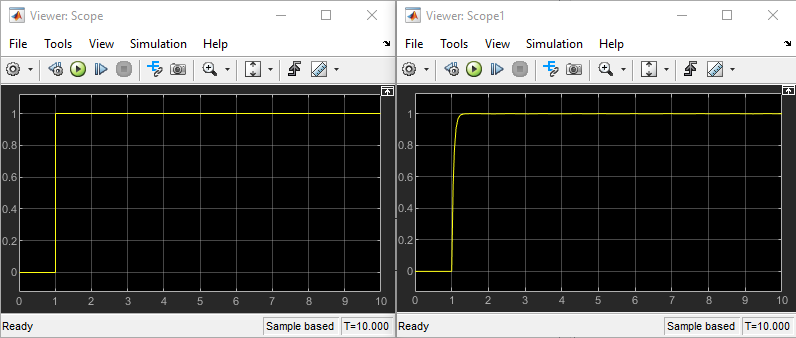

The results of the simulation of the model for the SAS are presented below:

- Simulink simulation results for the PCU

Note that the results show that the input step signal (left Scope) produces the desired result in the output displacement of the actuator (right Scope).