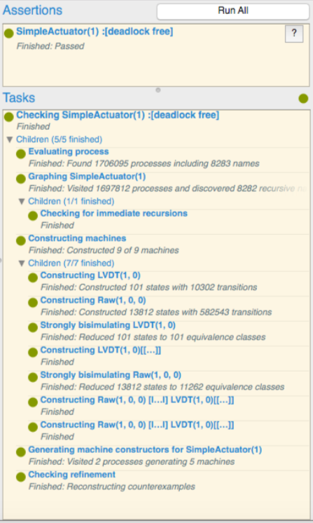

# Simple Actuator System (SAS) in CSPM

---

The complete CSPM specification is provided [HERE](sas.csp).

Listing 1 below shows how we constrain our channels to work on an smaller range of values instead of the whole **Int** (integer) type.

  ```haskell
  nametype displacement = { -50..50}
  nametype angularVelocity = { -150..150}
  nametype voltage = { -500..500}

  channel rawPosition, adjust: ActuatorId.displacement

  channel coreMoved: ActuatorId.displacement

  channel lvdtOutput: ActuatorId.voltage
  ```
  > Listing 1 CSPM specification constraints for the SAS

The Figure 1 below presents the results of the analysis in the *FDR*4 user interface. The verification of the assertion passed and *FDR* constructed nine (9) machines and, particularly, the processes LVDT(1,0) and Raw(1,0,0) have, respectively, 101 and 13812 states. The machines for these processes also have 10302 and 582543 transitions, respectively. Furthermore, *FDR* performed reduction of the state space using bisimulation and found 11262 equivalence classes for the Raw(1,0,0) process. The verification was performed in a Apple MacBook Air Mid 2011 with 4Gb RAM and 1,6GHz Intel Core i5 with macOS High Sierra (version 10.13.6).

  >  \
  > Fig 1 SAS Deadlock Analysis Results using FDR4

---
