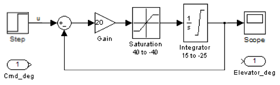
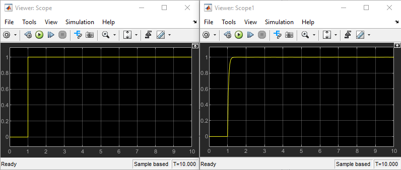

# Simple Actuator System (SAS) in Simulink

---

The Simulink model is provided [HERE](sas.mdl).

The SAS *Simulink* model in order to allow simulation execution is presented below:

  >  \
  > Simulink block diagram for the PCU Simulation

The results of the simulation of the model for the SAS are presented below:

  >  \
  > Simulink simulation results for the PCU

Note that the results show that the input step signal (left Scope) produces the desired result in the output displacement of the actuator (right Scope).

---
